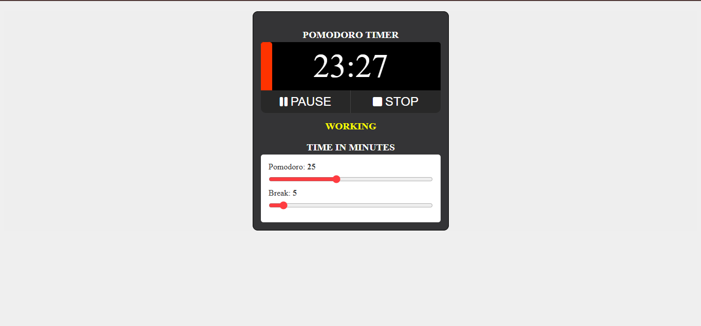

# Pomodoro Timer

A Pomodoro Timer web app built with HTML, CSS and JavaScript.

## How to Use

- Hit the play button to start the timer
- Use the pause button to pause or resume the session
- Drag the sliders to set your preferred Pomodoro and break durations
- The timer automatically switches between work and break sessions
- Hit the stop button to reset everything

## Sessions

| # | Session | Default Duration |
|---|---------|-----------------|
| 1 |  Pomodoro (Work) | 25 minutes |
| 2 |  Short Break | 5 minutes |

## Features

- 3D progress bar that fills as time elapses
- Auto-switches between work and break sessions
- Adjustable durations (1–60 min) via range sliders
- Visual status indicator (Working / Break)
- Pause and resume support
- Clean dark UI

## Want to contribute?
If something's broken or you have an idea that'd genuinely make this better:

- Fork it
- Branch off (git checkout -b feature/your-addition)
- Make your changes
- Commit with something descriptive (git commit -m "what and why")
- Push and edit the Readme for the changes

## Live Demo

[View here](https://coderpudding.github.io/Pomodoro-Timer/)
